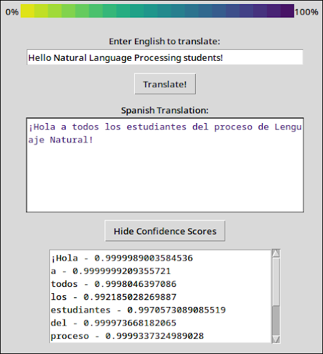

# Eng2Span - English-to-Spanish Translation with Word Level Confidence Scores
An English to Spanish translation project for CS 436 Natural Language Processing (Spring 2025)

#### Team Members
* Emma Gifford (emmagifford@u.boisestate.edu)
* Dylan Gresham (dylangresham@u.boisestate.edu)

## Overview
Eng2Span is a neural machine translation application designed to translate English text into Spanish text and enhance the translated text with word-level confidence scoring. Unlike traditional translation tools, Eng2Span aims not only to generate accurate translations, but also to enhance the user's understanding by indicating the model’s certainty for each translated word. This application enables users to input English text, view the Spanish translation, and assess confidence scores for the translation. The confidence score feedback allows users to identify potentially unreliable translation segments, promoting more informed and effective communication in bilingual contexts. 

This application was built on Python, using libraries and resources such as TensorFlow, HuggingFace, pandas, and Tkinter.

## Getting Started
<details>
  <summary>Project Structure</summary>
  <ul>
    <li><code>figures/</code> - Images used in our project</li>
    <li><code>logs/</code> - Final Slurm logs from fine tuning on Boise State's Borah Cluster</li>
    <li><code>notebooks/</code> - Jupyter Notebooks used for testing ideas and analyzing results</li>
    <li><code>results/</code> - CSV files containing results from our benchmarks and survey</li>
    <li><code>scripts/</code> - Shell scripts to make our lives a little easier</li>
    <li><code>src/</code> - Source code for our project
      <ul>
        <li><code>baselines/</code> - Scripts to create baselines for our models</li>
        <li><code>benchmarks/</code> - Scripts to create benchnmarks for our models</li>
        <li><code>finetuning/</code> - Scripts to finetune our models</li>
      </ul>
    </li>
  </ul>
</details>

### Requirements
* Python >= 3.12
<details> 
<summary>Python Libraries</summary>
  <ul>
    <li>accelerate>=1.5.2</li>
    <li>datasets>=3.4.1</li>
    <li>evaluate>=0.4.3</li>
    <li>huggingface-hub>=0.29.3</li>
    <li>jupyter>=1.1.1</li>
    <li>matplotlib>=3.10.1</li>
    <li>nltk>=3.9.1</li>
    <li>numpy>=2.2.4</li>
    <li>pandas>=2.2.3</li>
    <li>protobuf>=6.30.1</li>
    <li>requests>=2.32.3</li>
    <li>rouge-score>=0.1.2</li>
    <li>sacrebleu>=2.5.1</li>
    <li>sacremoses>=0.1.1</li>
    <li>scikit-learn>=1.6.1</li>
    <li>seaborn>=0.13.2</li>
    <li>sentencepiece>=0.2.0</li>
    <li>torch>=2.6.0</li>
    <li>transformers>=4.50.0</li>
    <li>wordcloud>=1.9.4</li>
  </ul>
</details>

### Setup
From the terminal...
* Check if Python is installed with the following command: `python --version` or `python3 --version`
  * If Python is not installed, download it from the [official Python website](https://www.python.org/downloads) (for Windows/Mac) or install it with your favorite package manager `sudo <package manager> install python3`
* If you would like, set up a virtual environment to separate out the required Python libraries for this project from your normal Python environment:
  * First, install the `venv` module with the following command: `python -m pip install virtualenv`
  * Create the virtual environment by running `python -m venv eng2span`
  * Activate the virtual environment with:
    * Windows: `eng2span\Scripts\activate`
    * Linux: `source eng2span/bin/activate`
  * Refer to the [`venv` documentation](https://docs.python.org/3/library/venv.html) for further exploration
* Use `pip`, the package manager for Python, to install the required libraries using the command from the project root: `pip install -r requirements.txt`
  * If some requirements from this file fail, try installing the the Python libraries listed in the [Requirements](#requirements) section. Use the following command: `pip install <package_name>=<version_number>`
* Once all necessary libraries are installed, you are ready to run the Eng2Span application!

### Running the Application
To run the Eng2Span application graphical user interface (GUI), run the following command in a terminal from the project root:

```sh
$ python src/gui.py
```
*Note: You may have a different way of calling Python to run a program. For example, my computer sees `py` as the Python command, not `python`.*

On its first run, the model will have to download to your computer. Depending on the power of your computer, the GUI may take a few seconds to load. You may see a few `tensorflow` logs while you wait.
Additionally, the GUI may not immediately pop up on your screen. Check the taskbar for the Tkinter feather icon, and click it when it appears.

The GUI should appear and look similar to the [example GUI display](#example-gui-display), but without text in the textboxes. (That is, the textboxes should be empty.)

### Translating
To an English phrase to translate, click on the textbox under "Enter English to translate:" and type your sentence in. When you are finished and ready to translate, click on the "Translate!" button. This will begin the translation!

The model may take a few seconds to translate the phrase, depending on the power of your computer and the length of its input. You will see "translating..." in the program's terminal output to indicate the "Translate!" button has been pressed and translation has begun.

When finished, the GUI will display the translated Spanish phrase in the large textbox under "Spanish Translation:". Each word in this textbox is colored to reflect the Confidence Bar at the top of the GUI screen. A lighter color means a lower confidence, and a darker color means a higher confidence.

To view the confidence scores in more detail, click the "Show Confidence Scores" button below the "Spanish Translation:" textbox. This will display each word and its numerical confidence score, rounded to three significant digits. If the words in your phrase exceed the size of the Confidence Score textbox, scroll within the box or use your mouse to click and drag on the scroll bar to the right side of the textbox to see more. To hide the confidence scores, click the "Hide Confidence Scores" button.

### Example GUI Display


## Troubleshooting
### Update the Python Path
If the module cannot be found, the Python path environment variable may need to be updated. Run the following command in a terminal for your specific operating system to update the Python path before running the program:
* Linux: `export PYTHONPATH=$PWD:$PYTHONPATH`
* Windows: `$env:PYTHONPATH = $pwd`
